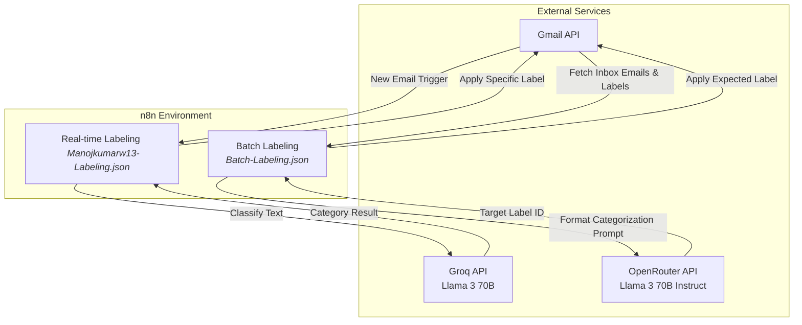

# AI-Powered Email Labeling with n8n

This project contains **n8n workflows** that automatically categorize and label incoming emails utilizing the power of Large Language Models (LLMs) via Langchain. By integrating the Gmail API with Groq and OpenRouter, the workflows intelligently analyze email content and apply appropriate labels.

## 🏗️ Architecture

## ⚙️ Workflows

### 1. Real-time Labeling Workflow (`Manojkumarw13-Labeling.json`)

- **Trigger:** Gmail Trigger polls every 10 minutes for new emails.
- **AI Processing:** Uses the `n8n-nodes-langchain.textClassifier` powered by LLaMA-3 (70B) via the **Groq API**.
- **Action:** Automatically categorizes emails into predefined classes (e.g., _Sign-In, Intern-Fetch, Coursera, Internship_) and applies the corresponding label ID in Gmail.

### 2. Batch Labeling Workflow (`Batch-Labeling.json`)

- **Trigger:** Manual Trigger for bulk processing.
- **Extraction:** Fetches all available labels and unread/inbox emails via the Gmail node.
- **AI Processing:** Structures the context of valid labels into a prompt, passing it to `meta-llama/llama-3-70b-instruct` via the **OpenRouter API**.
- **Action:** Analyzes the email subject and body to output an exact matching Label ID, efficiently grouping unstructured batch inboxes.

## 🚀 Setup & Installation

1. Import the provided `.json` files into your n8n workspace:
   - Go to your n8n workflows dashboard.
   - Click on **Import from File...** and select `Manojkumarw13-Labeling.json` and `Batch-Labeling.json`.
2. Configure Credentials:
   - **Gmail OAuth2:** Connect your Google account with correct read/write permissions for Gmail labels and messages.
   - **Groq API:** Supply your valid Groq API key for the real-time classification.
   - **OpenRouter API:** Supply your OpenRouter API key for the batch instruction-based classification.
3. Update specific Label IDs in the "Add Labels" and "Text Classifier" nodes to match your personal Gmail label IDs.
4. Activate the polling trigger on the Real-time workflow to let it run autonomously!

## 🛡️ License

This project is tailored for personal inbox automation. Feel free to use and modify the workflow JSONs for your tailored categorization needs.
