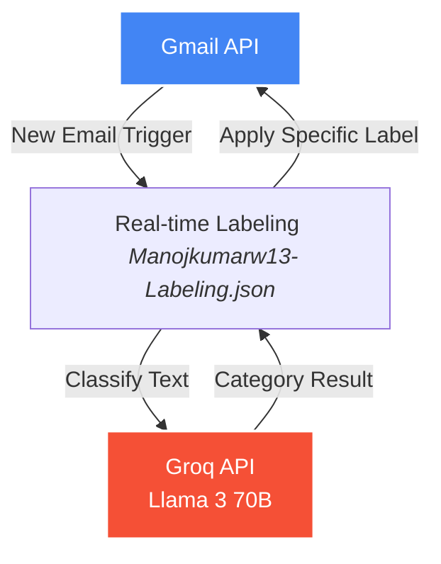
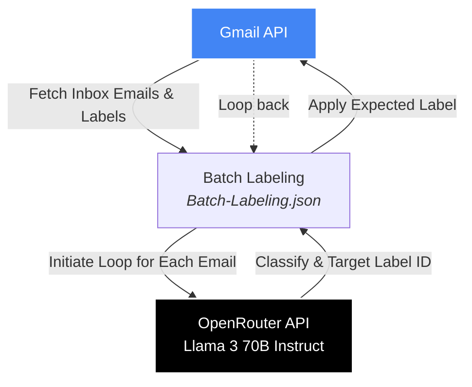
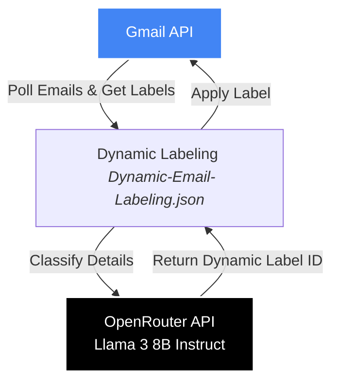

# 📧 AI-Powered Email Labeling with n8n

Welcome to the **AI-Powered Email Labeling** repository! This project provides robust, automated **n8n workflows** designed to organize your cluttered inbox using the power of Large Language Models (LLMs). By seamlessly blending the **Gmail API** with top-tier AI providers like **Groq** and **OpenRouter**, these workflows intuitively read, categorize, and label your emails without manual intervention.

---

## 📑 Table of Contents
- [✨ Features](#-features)
- [🏗️ Architecture](#-architecture)
  - [1. Real-time Labeling](#1-real-time-labeling-workflow)
  - [2. Batch Labeling](#2-batch-labeling-workflow)
  - [3. Dynamic Email Labeling](#3-dynamic-email-labeling-workflow)
- [⚙️ Workflow Details](#️-workflow-details)
- [🚀 Setup & Installation](#-setup--installation)
  - [Prerequisites](#prerequisites)
  - [Importing Workflows](#importing-workflows)
  - [Configuring Credentials](#configuring-credentials)
- [🛠 Troubleshooting](#-troubleshooting)
- [🔒 Security Note](#-security-note)
- [🤝 Contributing](#-contributing)
- [🛡️ License](#️-license)

---

## ✨ Features

- **Zero-Touch Organization:** Automatically process incoming emails in the background.
- **High-Accuracy Classification:** Utilizes LLaMA-3 (70B & 8B parameters) for intelligent semantic understanding rather than simple keyword matching.
- **Flexible Execution Modes:** 
  - *Real-time polling* for instant inbox zero.
  - *Batch processing* to clear out years of unread clutter.
- **Dynamic Context:** Workflows fetch your exact Gmail label structure dynamically, meaning you don't have to hardcode label names into the AI prompts.
- **Privacy First:** Processed securely through enterprise-grade APIs without exposing your inbox to rogue web apps.

---

## 🏗️ Architecture

### 1. Real-time Labeling Workflow

```mermaid
graph TD
    G[Gmail API] -->|New Email Trigger| W1[Real-time Labeling <br> <i>Manojkumarw13-Labeling.json</i>]
    W1 -->|Classify Text| Groq[Groq API <br> Llama 3 70B]
    Groq -->|Category Result| W1
    W1 -->|Apply Specific Label| G
    
    classDef api fill:#4285F4,color:white,stroke:#fff,stroke-width:2px;
    classDef ai fill:#F55036,color:white,stroke:#fff,stroke-width:2px;
    class G api;
    class Groq ai;
```

### 2. Batch Labeling Workflow

```mermaid
graph TD
    G[Gmail API] -->|Fetch Inbox Emails & Labels| W2[Batch Labeling <br> <i>Batch-Labeling.json</i>]
    W2 -->|Initiate Loop for Each Email| OR[OpenRouter API <br> Llama 3 70B Instruct]
    OR -->|Classify & Target Label ID| W2
    W2 -->|Apply Expected Label| G
    G -.->|Loop back| W2
    
    classDef api fill:#4285F4,color:white,stroke:#fff,stroke-width:2px;
    classDef ai fill:#000000,color:white,stroke:#fff,stroke-width:2px;
    class G api;
    class OR ai;
```

### 3. Dynamic Email Labeling Workflow

```mermaid
graph TD
    G[Gmail API] -->|Poll Emails & Get Labels| W3[Dynamic Labeling <br> <i>Dynamic-Email-Labeling.json</i>]
    W3 -->|Classify Details| OR[OpenRouter API <br> Llama 3 8B Instruct]
    OR -->|Return Dynamic Label ID| W3
    W3 -->|Apply Label| G

    classDef api fill:#4285F4,color:white,stroke:#fff,stroke-width:2px;
    classDef ai fill:#000000,color:white,stroke:#fff,stroke-width:2px;
    class G api;
    class OR ai;
```

---

## ⚙️ Workflow Details

### 1. Real-time Labeling Workflow (`Manojkumarw13-Labeling.json`)
- **Trigger:** Gmail Trigger polls every 10 minutes for new emails.
- **AI Processing:** Uses the `n8n-nodes-langchain.textClassifier` powered by **LLaMA-3 (70B)** via the extremely fast **Groq API**.
- **Action:** Automatically categorizes emails into predefined classes (e.g., *Sign-In*, *Intern-Fetch*, *Coursera*, *Internship*) and applies the corresponding label ID in Gmail. Perfect for keeping your daily incoming mail sorted seamlessly.

### 2. Batch Labeling Workflow (`Batch-Labeling.json`)
- **Trigger:** Manual Trigger designed for executing bulk processing jobs.
- **Extraction:** Fetches all available labels and unread/inbox emails via the Gmail node.
- **AI Processing:** Structures the context of valid labels into a strict prompt, passing it to `meta-llama/llama-3-70b-instruct` via the **OpenRouter API**.
- **Action:** Analyzes the email subject and body to output an exact matching Label ID, efficiently grouping unstructured batch inboxes. Ideal for initially setting up your zero-inbox environment.

### 3. Dynamic Email Labeling Workflow (`Dynamic-Email-Labeling.json`)
- **Trigger:** Scheduled Gmail Trigger polls every 10 minutes.
- **Dynamic Extraction:** Dynamically queries the Gmail API for all available labels to construct the classification context on the fly. 
- **AI Processing:** Leverages `meta-llama/llama-3-8b-instruct` through the **OpenRouter API** to classify the email based strictly on the freshly fetched distinct labels.
- **Action:** Applies the dynamically determined Label ID to the incoming email without the need for manual ID adjustments inside n8n.

---

## 🚀 Setup & Installation

### Prerequisites
Before you begin, ensure you have the following ready:
1. **n8n Instance:** A running [n8n environment](https://docs.n8n.io/hosting/) (Self-hosted or Cloud).
2. **Google Cloud Console Project:** Enabled **Gmail API** with OAuth2 credentials (Client ID & Secret).
3. **API Keys:** 
   - [Groq API Key](https://console.groq.com/keys)
   - [OpenRouter API Key](https://openrouter.ai/keys)

### Importing Workflows
1. Log in to your n8n workspace.
2. Navigate to your workflows dashboard.
3. Click the downward arrow next to **Add Workflow** (or find the import icon on the canvas).
4. Click on **Import from File...** and individually select the JSON files:
   - `Manojkumarw13-Labeling.json`
   - `Batch-Labeling.json`
   - `Dynamic-Email-Labeling.json`

### Configuring Credentials
Setting up secure connections is vital. Follow these steps within n8n:
1. **Gmail OAuth2:** 
   - Add a new Application credential for Gmail OAuth2.
   - Supply your Google Cloud Client ID and Secret.
   - Ensure the scopes cover read/write capabilities for labels and messages (`https://www.googleapis.com/auth/gmail.modify`, `https://www.googleapis.com/auth/gmail.labels`).
   - Authenticate.
2. **Groq API:** Create a new node credential for Groq and paste your API key. Used primarily in the real-time workflow.
3. **OpenRouter API:** Create a standard Header Auth or Custom API credential to inject your `Bearer [OPENROUTER_KEY]` for the Batch and Dynamic workflows.
4. **Final Check:** Update any hard-coded specific Label IDs in the "Add Labels" / "Text Classifier" nodes of the static workflows to match your specific Google account structures.

Activate the polling triggers in the Real-time and Dynamic workflows, and enjoy your automated inbox!

---

## 🛠 Troubleshooting

| Issue | Resolution |
| :--- | :--- |
| **Gmail Trigger fails to execute** | Ensure your Google OAuth token has not expired and your Google Cloud App is in 'Production' status, or re-authenticate your test account every 7 days. |
| **OpenRouter / Groq HTTP 401 Unauthorized** | Double check that your API keys are valid and have sufficient credits/limits. |
| **Labels are not being attached** | Verify that the returned string from the AI EXACTLY matches the `id` of your custom Gmail label, not just the name. The Dynamic Workflow handles this automatically! |

---

## 🔒 Security Note

**Important:** Please ensure that all personal credentials, API keys, and exact Label IDs are removed from the workflow JSON files before you share them publicly, commit them to a repository, or paste them into forums. Treat your n8n workspace access as the keys to your inbox.

---

## 🤝 Contributing
Contributions are totally welcome! If you have built an optimized prompt, a better workflow variation, or integration with another LLM provider (Ollama, OpenAI, Anthropic), feel free to:
1. Fork the Project
2. Create your Feature Branch (`git checkout -b feature/AmazingFeature`)
3. Commit your Changes (`git commit -m 'Add some AmazingFeature'`)
4. Push to the Branch (`git push origin feature/AmazingFeature`)
5. Open a Pull Request

---

## 🛡️ License

This project is tailored for personal inbox automation and shared openly. Feel free to use, fork, and modify the workflow JSONs for your strictly tailored categorization needs.
